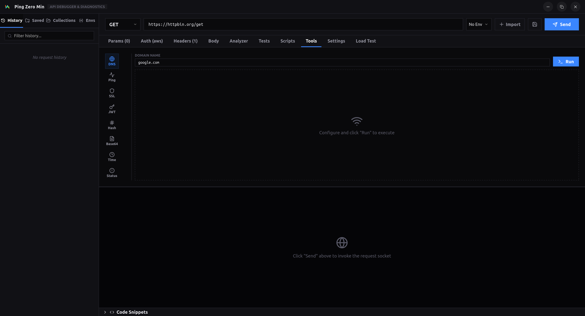
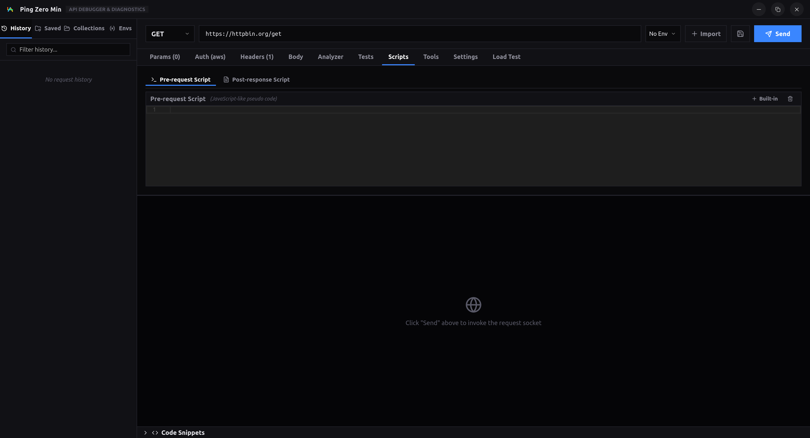

<div align="center">
  
  <h1>PingZero Mini 🚀</h1>
  <p><strong>A Modern, Ultra-Fast, and Advanced API Testing Client Built with Tauri & Rust.</strong></p>
</div>

---

## 🌟 Overview

**PingZero Mini** is a powerful API development and testing tool integrated right into Alouette Studio. Designed to rival enterprise tools like Postman and Insomnia, PingZero Mini focuses on extreme performance, native capabilities, and comprehensive protocol support. 

From standard REST APIs to advanced streaming protocols and complex authentication flows, PingZero Mini handles it all without breaking a sweat.

---

## ✨ Key Features

### 1. 🌐 Comprehensive Protocol Support
PingZero Mini isn't just for HTTP. It supports a wide array of modern communication protocols:
- **REST / HTTP(S):** Full support for GET, POST, PUT, DELETE, PATCH, and custom methods.
- **WebSocket (WS/WSS):** Real-time, interactive socket testing with live event streams.
- **Server-Sent Events (SSE):** Native support for one-way event streaming.
- **gRPC (Dynamic):** Test your microservices using dynamic gRPC reflection.

### 2. 🔐 Advanced Authentication
Testing secure endpoints has never been easier.
- **OAuth 2.0:** Built-in local server capable of launching your browser, handling callbacks, and extracting Access Tokens automatically.
- **Mutual TLS (mTLS):** Direct support for Client Certificates (`.pem`). Easily bypass enterprise firewalls and test banking/internal APIs.
- **Bearer & Basic Auth:** One-click integration for standard authorization headers.

<div align="center">
  
</div>

### 3. 📂 OpenAPI & Swagger Importer
Stop writing requests by hand. PingZero Mini features a powerful **OpenAPI Importer**.
- Fetch directly from a URL to your `swagger.json` or paste the JSON text directly.
- Automatically generates Collections, Folders, and pre-configured Requests.

<div align="center">
  
</div>

### 4. ⚡ Load Tester (Stress Testing)
Don't just test if your API works—test if it scales.
- Built-in concurrent Load Tester powered by Rust's `tokio`.
- Set RPS (Requests Per Second) and Duration.
- View real-time charts and metrics (Success/Error rates, Latency).

### 5. 🛠️ Network Tools
Debug your infrastructure directly from the client.
- **DNS Lookup:** Resolve domains to IPv4, IPv6, CNAME, MX, and TXT records.
- **Ping / TCP Check:** Verify host reachability and network latency.
- **SSL/TLS Inspector:** Read certificate chains, issuer details, and expiration dates.

<div align="center">
  
</div>

### 6. 📜 Pre/Post Scripts & Validation
Write custom logic to chain requests together or validate responses.
- Write scripts in JavaScript.
- Set/Get Environment Variables programmatically.
- Validate JSON responses against strict JSON Schemas.

<div align="center">
  
</div>

---

## 🚀 Tech Stack

PingZero Mini is engineered for maximum performance:
- **Frontend:** React, TypeScript, Vite.
- **Backend:** Rust, Tauri, Tokio, Reqwest.
- **Styling:** CSS Variables, Glassmorphism, Lucide Icons.

By utilizing Tauri and Rust, PingZero Mini consumes a fraction of the RAM compared to Electron-based alternatives while providing native network-level access (bypassing browser CORS completely).

---

## 🛠️ How to Run Locally

If you are developing or running Alouette Studio locally:

1. **Install Prerequisites:** Ensure you have Node.js and Rust installed.
2. **Install Dependencies:**
   ```bash
   cd tauri_app/ui
   npm install
   ```
3. **Run in Development Mode:**
   ```bash
   npm run tauri dev
   ```
4. **Build for Production:**
   ```bash
   npm run tauri build
   ```

---

<div align="center">
  <i>Built with ❤️ for Alouette Studio</i>
</div>
