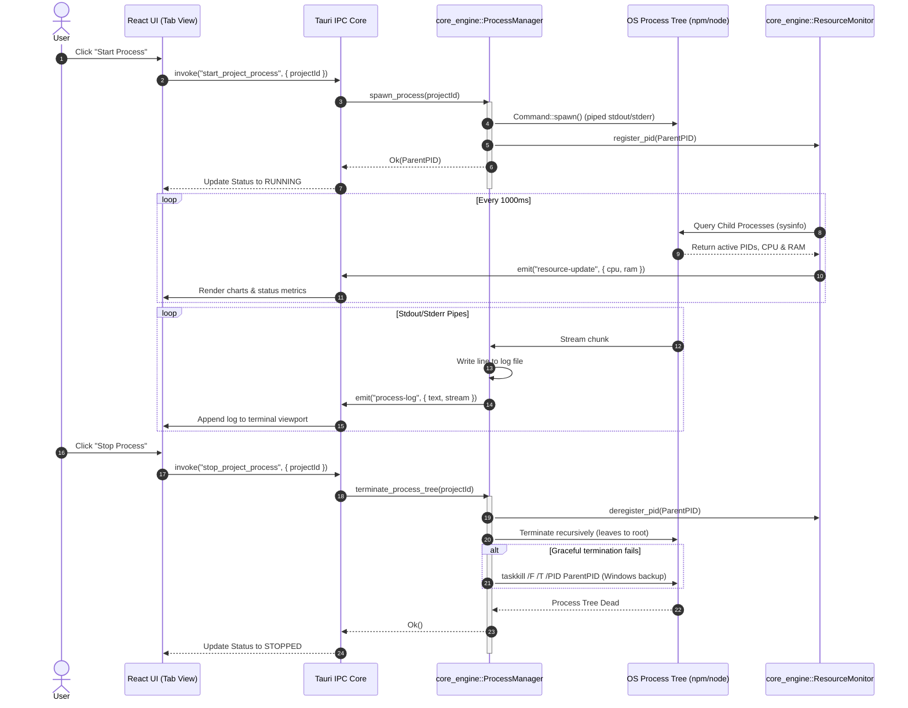

# Monolithic Architecture Blueprint: Process Runner & Resource Monitor

This document outlines the system architecture and communication boundary between the Tauri v2 Desktop Wrapper (`tauri_app`) and the asynchronous Rust logic core (`core_engine`).

## 1. System Topology & Layers

The application is structured into three clean, decoupled architectural layers:

```text
+-------------------------------------------------------------+
|                     TypeScript / React UI                   |
|   (Component Shell, virtual terminals, state context, charts)|
+-------------------------------------------------------------+
                              |
                     IPC Command / Events (JSON)
                              |
+-------------------------------------------------------------+
|                     Tauri v2 Desktop App                    |
|   (IPC Handlers, AppState hydration, Window Event Router)   |
+-------------------------------------------------------------+
                              |
                     Rust API / Native Calls
                              |
+-------------------------------------------------------------+
|                     core_engine Rust Library                |
|   (Config watch, Tokio Process spawner, PID tree monitor)   |
+-------------------------------------------------------------+
```

---

## 2. IPC Communication Boundary

Communication between the Frontend UI and the Rust Backend uses Tauri's IPC boundary (Commands and Events):

1. **Commands (Frontend -> Backend):** High-level requests to invoke actions or retrieve snapshots.
   - `start_project(project_id)`: Spawn the tokio task for the selected tab.
   - `stop_project(project_id)`: Perform graceful shutdown, followed by recursive tree teardown.
   - `get_projects_config()`: Read the system's registered tabs configurations.
2. **Events (Backend -> Frontend):** Real-time, decoupled streams triggered asynchronously.
   - `process-log`: Streamed line-by-line `{ project_id: String, stream: "stdout" | "stderr", text: String, timestamp: u64 }`.
   - `process-status`: Dispatched on lifecycle changes `{ project_id: String, status: ProjectStatus }`.
   - `resource-update`: Aggregated CPU and RAM values `{ project_id: String, cpu_percentage: f32, ram_bytes: u64 }`.

---

## 3. Process Execution Sequence Diagram

The following sequence diagram outlines the entire lifecycle of a registered tab instance from the UI trigger to its graceful or forced teardown:



---

## 4. Multi-Thread State Safety

Global state is hydrated in Tauri using a thread-safe `AppState` managed pointer:
```rust
pub struct AppState {
    pub process_manager: Arc<Mutex<ProcessManager>>,
    pub resource_monitor: Arc<ResourceMonitorController>,
}
```
Access to process commands is synchronized via non-blocking async lock guards or thread-safe channels (`tokio::sync::mpsc`), ensuring that even under severe system stress or rapid user tab-switching, race conditions are mathematically impossible.
