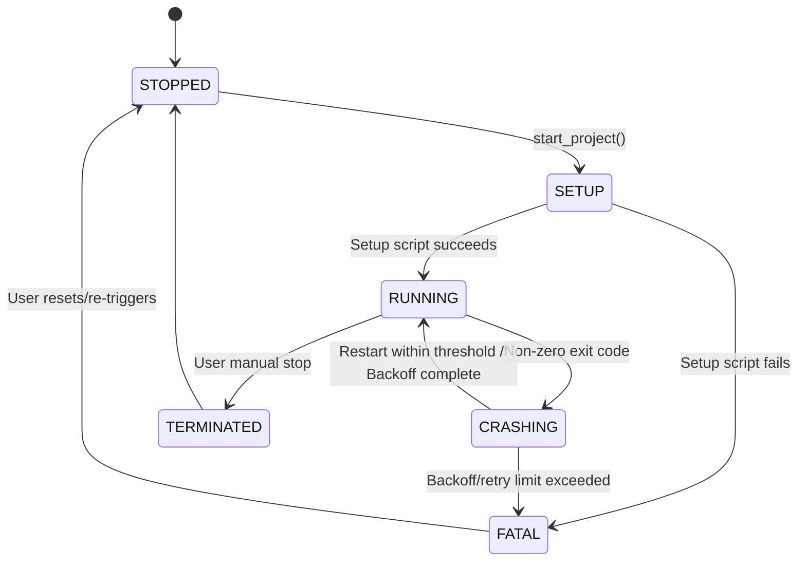

# Process Lifecycle, Crash Loops & State Mitigations

This document outlines the state machine, sequential pre-start execution pipeline, and crash-loop backoff algorithms implemented in the process runner.

## 1. Process State Machine

Each project instance resides in precisely one state at any given moment:

### State Specifications:
- **`STOPPED`**: Process is idle and holds zero resources.
- **`SETUP`**: Optional pre-flight checks or install tasks (e.g., `npm install`) running sequentially before main start.
- **`RUNNING`**: The main task command is actively executing and stdout/stderr pipes are open.
- **`CRASHING`**: Task terminated unexpectedly. Handled by crash mitigations.
- **`TERMINATED`**: Process tree was successfully killed by user command.
- **`FATAL`**: Process failed repeatedly or setup failed. Locked out until user intervention.

---

## 2. Pre-Start Execution Pipeline (Setup Hook)

Before launching the primary command (e.g., `npm run dev`), the process manager checks for a `setup_command` field in the tab configuration. 
The pipeline executes as follows:
1. State changes to `SETUP`.
2. A sequential async tokio process spawns for the setup command.
3. If it returns exit code `0`, the system automatically transitions to `RUNNING` and spawns the primary command.
4. If it returns a non-zero exit code or times out, the system registers a `SetupError`, shifts directly to `FATAL`, and writes the failure log to `/logs/[project_name].log`.

---

## 3. Crash Loop & Exponential Backoff Mathematical Model

To protect system resources from runaway processes (e.g. infinite immediate crashes due to port conflicts), we implement an exponential backoff retry loop.

### Mathematical Definition of Backoff:
When a process transitions to `CRASHING`, the next restart delay $T_{\text{wait}}$ is computed as:

$$T_{\text{wait}} = \min(T_{\text{base}} \times 2^{r}, T_{\text{max}})$$

Where:
- $T_{\text{base}} = 1.0\text{ seconds}$ (initial retry delay)
- $r = \text{current sequential retry count}$
- $T_{\text{max}} = 60.0\text{ seconds}$ (maximum ceiling delay)

If a process runs stably for more than $30.0\text{ seconds}$, the retry count $r$ is reset to $0$.

### Threshold Termination:
If $r$ exceeds $R_{\text{max}} = 5$ successive immediate crashes (defined as crashing within less than $5\text{ seconds}$ of start), the system stops attempting automatic restarts, marks the state as `FATAL`, and dispatches a critical dashboard alert. This ensures a misconfigured project cannot consume 100% of local CPU cycles through loop restarts.
