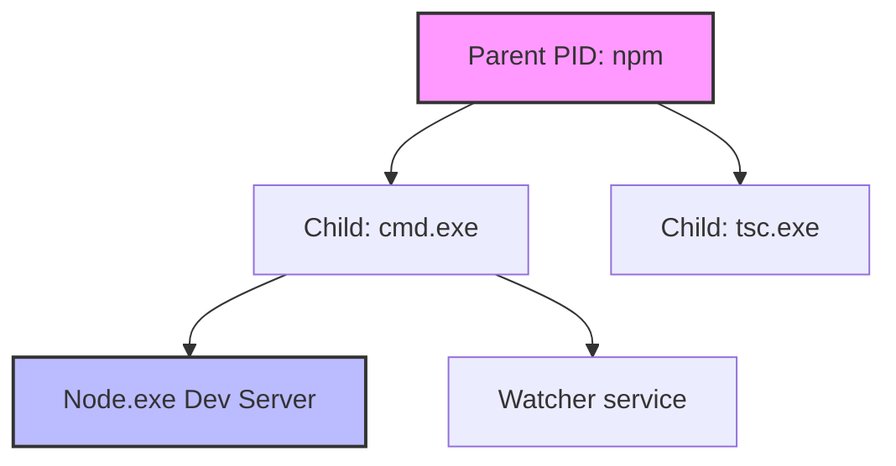

# High-Performance Resource Monitoring & Process Tree Crawling

This document describes the technical specifications for low-overhead, multi-thread safe native process monitoring.

## 1. The Windows Grand-Child Process Challenge

In Windows desktop development, tools like `npm`, `yarn`, or batch scripts spawn wrapper commands (`cmd.exe` or `powershell.exe`) which in turn spawn the target compiler or node engine (e.g., `node.exe`).
- When a `tokio::process::Child` is created, it only knows the PID of the direct parent process.
- Calling `.kill()` or measuring resources on that parent PID ignores all active grandchildren, leaking CPU consumption and failing to kill underlying servers.

---

## 2. Dynamic PID Tree Crawling Algorithm

To compute accurate resource aggregation and ensure zero-leak termination, our background monitor thread dynamically reconstructs the active process tree.

### Crawl Routine (Iterative BFS):
Given a root `ParentPID`:
1. Initialize an empty set `TreePIDs` and a queue `Q = [ParentPID]`.
2. Refresh the global process list from the operating system (`sysinfo::System::refresh_processes`).
3. While `Q` is not empty:
   - Dequeue `CurrentPID`.
   - Insert `CurrentPID` into `TreePIDs`.
   - Iterate over all active system processes:
     - If `process.parent_pid == CurrentPID`, append `child.pid` to `Q`.
4. Return `TreePIDs`.

---

## 3. Mathematical Resource Calculations

Every 1000ms, the tracking loop crawls the tree and aggregates the consumption metrics:

### Memory Footprint (Resident Set Size - RSS):
The aggregated memory $M_{\text{total}}$ is the mathematical sum of the physical bytes resident in RAM for all PIDs in our tree:

$$M_{\text{total}} = \sum_{p \in \text{TreePIDs}} \text{Memory}(p)$$

### CPU Usage Percentage:
The CPU usage in `sysinfo` returns the percentage utilized *per core*. For a multi-core CPU (e.g., 8 logical cores), a process fully utilizing 1 core will register as `100.0%`, with a theoretical maximum of `800.0%`. 
To ensure a clean dashboard representation, we normalize this aggregated percentage $C_{\text{normalized}}$ based on the system's logical core count $N$:

$$C_{\text{aggregated}} = \sum_{p \in \text{TreePIDs}} \text{CPU}(p)$$

$$C_{\text{normalized}} = \frac{C_{\text{aggregated}}}{N}$$

---

## 4. Avoiding Thread-Pool Starvation
Calculating CPU and scanning system-wide processes are blocking CPU-bound operations. Doing this on the primary Tokio async executor would starve other async tasks (like IPC request handling).

### Thread Isolation Architecture:
1. The monitor houses a dedicated, persistent operating system thread via `std::thread::spawn`.
2. Inside this thread, a dedicated `sysinfo::System` struct maintains historical state necessary for calculating CPU deltas.
3. Communication occurs via lock-free channels:
   - **Input Channel (`mpsc::channel`)**: Tauri or Process manager sends `Register(PID)` or `Deregister(PID)` requests.
   - **Output Channel (`broadcast::channel`)**: Every 1000ms, the monitor publishes aggregated tick updates.
4. This ensures the main async thread pool remains responsive at $<1\text{ms}$ latency.
