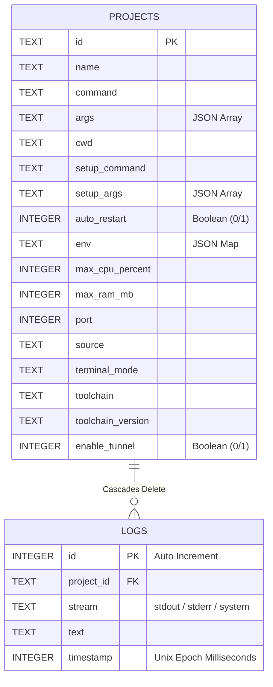

# SQLite Persistence & Log Pruning System

This document details the architecture, database schema, thread safety patterns, and lifecycle management implemented for server configurations and log storage in Alouette Server.

---

## 1. Database Schema Design

We use a lightweight, serverless, and highly concurrent **SQLite** database (`alouette.db`) located in the application's secure data directory (`app_data/alouette.db`).

### Schema Diagram



### Table Details:
1. **`projects`**: Stores complete server/tab configurations. Complex structures (such as `args` lists, environment variables maps, and optional toolchains) are serialized into clean, validated JSON text fields inside database rows.
2. **`logs`**: Stores stdout, stderr, and system notifications produced by active servers. It implements a foreign key constraint referencing `projects(id) ON DELETE CASCADE`, ensuring that if a user deletes a server, all historical logs for that server are instantly and cleanly purged from disk.

---

## 2. High-Performance Concurrency (WAL Mode)

To ensure the user interface remains fluid and the execution logging remains fast even under intense output loads, the SQLite database is initialized with **Write-Ahead Logging (WAL)**:

```sql
PRAGMA journal_mode=WAL;
PRAGMA foreign_keys = ON;
```

### Benefits of WAL in Alouette:
* **Concurrent Execution**: SQLite allows multiple readers to read the database at the same time a background task is appending server logs. Readers do not block writers, and writers do not block readers.
* **Fewer Disk Syncs**: WAL groups multiple log insertions together before flushing them to the physical disk, dramatically reducing I/O write operations.

---

## 3. Safe Thread & Blocking-Task Management

SQLite is an in-process synchronous library. To prevent blocking the asynchronous **Tokio multi-threaded event loop** of the Rust core engine, all database queries and transactions are dispatched into dedicated OS worker threads using `tokio::task::spawn_blocking`.

### Architecture Flow:

```text
[ ProcessManager ] -- (Tokio Async Loop)
                          |
                          | (spawn_blocking)
                          v
         [ OS Dedicated Thread Pool ] 
                    |
      (Synchronous SQLite Operations)
                    |
                    v
            [ alouette.db ]
```

### Code Pattern for Safe Async Reads:
```rust
#[tauri::command]
async fn get_project_logs(
    state: State<'_, AppState>,
    project_id: String,
    limit: Option<usize>,
) -> Result<Vec<ProcessLog>, String> {
    let pm = state.process_manager.lock().await;
    let limit_val = limit.unwrap_or(1000);
    let db = pm.db_manager.clone();
    
    // Execute blocking database reads in a separate thread context
    let logs = tokio::task::spawn_blocking(move || {
        db.get_logs(&project_id, limit_val)
    })
    .await
    .map_err(|e| format!("Task join error: {}", e))??;
    
    Ok(logs)
}
```

---

## 4. Automatic Log Pruning & Disk Control

To guarantee that the application's local database does not consume gigabytes of disk space over time, Alouette implements a **Log Pruning Algorithm**.

### Pruning Algorithm:
Whenever a log line is captured from stdout/stderr, the engine writes it to SQLite and immediately runs a pruning operation to delete any rows exceeding the configured line ceiling (default is the **5,000 most recent logs** per server).

```sql
DELETE FROM logs 
WHERE project_id = ?1 
  AND id NOT IN (
      SELECT id FROM logs 
      WHERE project_id = ?1 
      ORDER BY timestamp DESC, id DESC 
      LIMIT ?2
  );
```

This guarantees an O(1) upper-bound disk footprint for the server, preserving lightning-fast query times while retaining historical context for UI tab switches.
